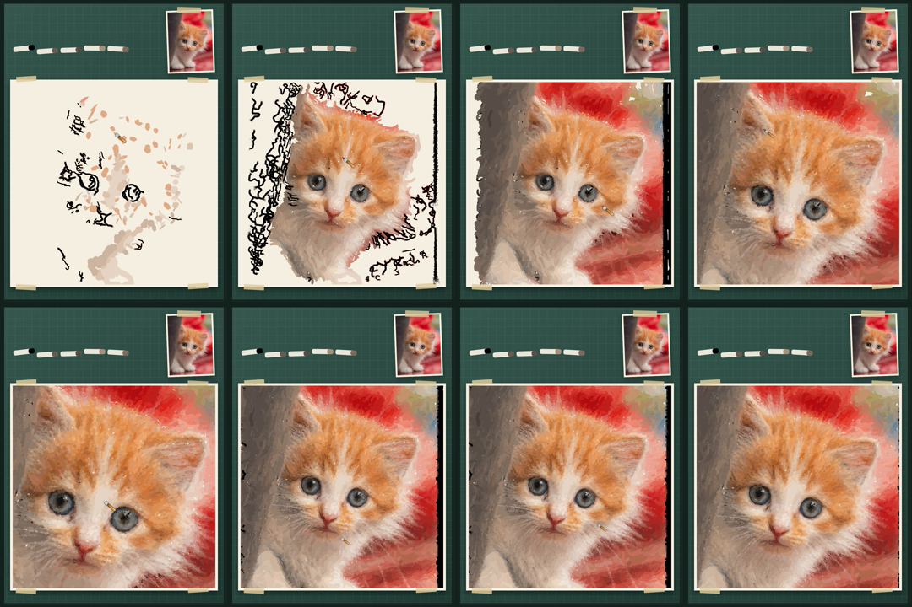
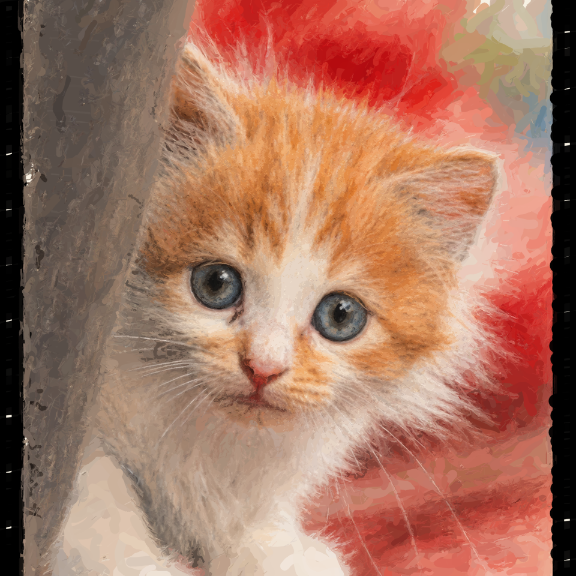

# Photo to Hand-Drawn Video Skill（S 版）

把一张照片和一张风格目标图，变成一段**真实逐笔绘制**的视频。

这不是把目标图盖上去，再用遮罩慢慢揭开。S 版会先识别主体和重点区域，再生成有限宽度的连续笔迹，最后交给 MyPaint 系真笔刷逐笔渲染。人物或宠物会先画，周围环境后画；细节阶段自动加速；画笔图标只跟随正在落下的笔迹。

> 当前状态：可用的实验版，约 85 分。已经在单人物全身照和单只居中宠物上跑通，但不承诺任意照片都能一次成功。

## 它解决了什么

很多“绘画过程视频”本质上是三种东西：目标图遮罩揭露、几十像素的小图块复制，或者整张图在最后突然出现。静止看还行，一动就很假。

S 版给自己加了几条硬约束：

- 目标图只能参与离线规划，运行时不能贴回画布；
- 每一次变化都必须来自一条有限宽度的笔迹；
- 主体结构先于背景细节；
- 五官、头发/毛发、衣服和主要配饰单独分配精修预算；
- 自动门禁与人的视觉验收分开，指标通过不等于作品已经好看。

## 当前效果

保留版的宠物样例使用 98,848 条笔迹，成片 64 秒，视频末帧 SSIM 为 0.7838。这个数字只表示末帧与风格目标的结构和颜色接近程度，不代表可以靠复制目标图刷高分。





[查看无音乐低分辨率演示视频](docs/demo-s-kitten-silent.mp4)

## 支持范围

目前支持：

- 单人全身或半身照片；
- 单只、主体较居中、头部清楚的猫狗等宠物；
- 一张 1:1 的风格目标图；
- 1080 × 1440、25 fps 的竖屏成片；
- 可选背景音乐和末尾淡出。

暂不支持：多人合影、多个面孔、主体太小、严重遮挡、复杂文字/Logo、任意构图的稳定一次通过。彩色铅笔、水彩等风格不在这个 S 版里。

## 依赖

| 依赖 | 用途 | 建议版本 |
|---|---|---|
| Python | 语义预检、笔迹规划和验收 | 3.11 |
| Node.js | Playwright 逐帧渲染 | 20+ |
| FFmpeg | PNG 帧编码、音乐混合 | 6+ |
| Playwright Chromium | 确定性 Canvas 渲染 | `package.json` 锁定 |
| MediaPipe | 人脸与人物区域识别 | 0.10.21 |
| NumPy / SciPy / scikit-image / Pillow | 图像分析和连续优化 | 见 `requirements.txt` |
| brushlib-wasm | MyPaint 兼容真笔刷 | 用户自行提供构建 |

开发和完整成片验证环境是 macOS Apple Silicon + Python 3.11；本次公开包的低预算冒烟也在 Python 3.9.6 通过。Linux 理论可用，但我没有做完整矩阵测试；Windows 还没有验证。

## 安装

```bash
git clone https://github.com/threerocks/photo-to-hand-drawn-video-skill.git
cd photo-to-hand-drawn-video-skill

python3.11 -m venv .venv
.venv/bin/pip install -r skills/photo-to-hand-drawn-video/scripts/requirements.txt

npm install
npm run install:browser
```

再安装系统 FFmpeg。macOS 可以用：

```bash
brew install ffmpeg
```

### 准备 MediaPipe 和真笔刷运行时

```bash
.venv/bin/python skills/photo-to-hand-drawn-video/scripts/setup_runtime.py \
  --brushlib-dir /absolute/path/to/your/brushlib-wasm-build
```

`setup_runtime.py` 会从 Google 官方地址下载约 20MB 的 MediaPipe 模型并校验 SHA-256。传入的 brushlib 目录必须包含：

- `brushlib.js`
- `brushes.js`
- `brushlib.wasm`

脚本会把 WASM 转成浏览器可离线加载的内联文件。

注意：`eliot-akira/brushlib-wasm` 的 GitHub 仓库目前没有声明许可证，因此本仓库不直接分发它的 JS/WASM 文件。使用前请自行确认授权，尤其是商业项目。详情见 [third-party.md](skills/photo-to-hand-drawn-video/references/third-party.md)。

## 作为 Codex Skill 安装

把 `skills/photo-to-hand-drawn-video` 复制或软链接到你的 Codex skills 目录：

```bash
ln -s "$(pwd)/skills/photo-to-hand-drawn-video" \
  "$HOME/.codex/skills/photo-to-hand-drawn-video"
```

然后可以这样调用：

```text
Use $photo-to-hand-drawn-video to turn this photo into a real stroke-by-stroke drawing video.
```

## 使用

### 1. 准备两张图

- `reference.jpg`：原照片。
- `target.png`：1:1 风格目标图，人物/宠物身份、姿态、主要衣服/毛色、配饰和构图要与原照片一致。

目标图不是可选滤镜，它决定了最终画什么。Skill 可以配合图像生成工具先得到目标图，但最多重试三次；三次仍过不了语义预检就应该停，不要给某张图手写坐标硬过。

### 2. 先只生成计划和预览

```bash
.venv/bin/python skills/photo-to-hand-drawn-video/scripts/run_generalized_s.py \
  --reference /absolute/path/reference.jpg \
  --target /absolute/path/target.png \
  --subject-type human \
  --run-dir skills/photo-to-hand-drawn-video/scripts/runs/my-first-run \
  --budget-scale 0.5
```

宠物把 `--subject-type human` 改成 `animal`。二次元/动漫插画用 `anime`（自动用头发蒙版估算脸部，不需要 MediaPipe 人脸检测）。确认 `semantic-preflight.json` 为 `PASS`，再打开 `generalized-s-preview.png` 看主体、脸/头部和背景顺序是否合理。

### 3. 跑 S 高精版成片

```bash
.venv/bin/python skills/photo-to-hand-drawn-video/scripts/run_generalized_s.py \
  --reference /absolute/path/reference.jpg \
  --target /absolute/path/target.png \
  --subject-type animal \
  --run-dir skills/photo-to-hand-drawn-video/scripts/runs/my-production-run \
  --budget-scale 2.0 \
  --render \
  --duration 64.03 \
  --fps 25
```

需要音乐时再加：

```bash
--music /absolute/path/music.mp3
```

### 3b. 抖音竖屏 9:16 + 笔刷风格（可选）

```bash
.venv/bin/python skills/photo-to-hand-drawn-video/scripts/run_generalized_s.py \
  --reference /absolute/path/reference.jpg \
  --target /absolute/path/target.png \
  --subject-type anime \
  --run-dir skills/photo-to-hand-drawn-video/scripts/runs/douyin-run \
  --budget-scale 1.0 \
  --render \
  --stage-width 1080 --stage-height 1920 \
  --brush-style marker
```

竖屏输出 1080×1920（9:16），画纸自动居中放大。笔刷风格可选：`marker`（默认，马克笔/漫画感）、`pencil`（铅笔素描颗粒）、`ink`（水墨淡彩）、`airbrush`（喷枪柔焦）。

输出目录包含：

- `semantic-preflight.json` 和自动区域蒙版；
- `generalized-base-plan.json`；
- `generalized-s-plan.json`；
- `generalized-s-preview.png`；
- `generalized-s.mp4`；
- `video-validation.json`；
- `run-summary.json`。

## 参数怎么选

- `--budget-scale 0.25`：只用于快速冒烟检查。
- `--budget-scale 0.5`：看结构和笔序。
- `--budget-scale 1.0`：常规质量。
- `--budget-scale 2.0`：S 保留版质量，耗时和笔迹数明显增加。
- `--subject-type auto`：先尝试人物预检，失败后回退宠物适配器；需要先安装 MediaPipe 模型。
- `--subject-type anime`：二次元/动漫插画专用适配器，用头发蒙版估算脸部区域，对 2D 脸更稳定。
- `--stage-width / --stage-height`：输出视频尺寸，默认 1080×1440（3:4 竖屏）；抖音 9:16 用 `1080 1920`。
- `--artboard-size`：内部超采样画布边长，默认 3840（画质优先）；内存紧张时用 `2880`。
- `--brush-style`：笔刷风格，`marker`（默认）/ `pencil` / `ink` / `airbrush`。
- `--skip-video-validation`：只在调试时用，正式结果不建议跳过。

渲染器会暂存逐帧 PNG，磁盘占用可能达到数 GB。计划阶段也可能持续数分钟，2.0 预算不适合拿来反复试错，所以一定先跑 0.5 预览。

## 管线原理

```text
原照片 + 风格目标图
        ↓
语义预检：主体 / 身份 / 脸或头 / 衣服或毛发 / 配饰 / 背景
        ↓
主体优先基础笔序
        ↓
只接受能降低局部误差的连续有限宽笔迹
        ↓
MyPaint 兼容真笔刷逐笔渲染 + 画笔跟随 + 细节段加速
        ↓
FFmpeg 编码 / 可选音乐
        ↓
反揭图门禁 + 末帧相似度 + 人工观看验收
```

详细说明见 [pipeline.md](skills/photo-to-hand-drawn-video/references/pipeline.md) 和 [acceptance.md](skills/photo-to-hand-drawn-video/references/acceptance.md)。

## 为什么一定要人工看一遍

自动门禁只能证明它没有明显靠“揭图”作弊，也能证明末帧没有完全跑偏。它证明不了脸好不好看、毛发像不像、某一段是不是像在空画。

正式交付前至少看六件事：主体是否先成形；开头有没有大横刷；画笔是否跟着真实笔迹；细节段是否近似静止；脸/头部与主要配饰是否像；结尾有没有假扫掠。任何一条失败，就算 JSON 全是 PASS 也应该退回去。

## 隐私与版权

- 不要提交用户原照片、生成目标图、音乐和生产视频。
- 发布前清理照片和目标图的 EXIF、GPS、来源扩展属性。
- 音乐必须确认发布权利；本仓库不包含测试时使用的《萱草花》。
- `LICENSE` 只覆盖本仓库原创代码，不自动覆盖第三方运行时、模型、照片、目标图和成片。

## 许可证

原创代码使用 MIT License。第三方组件适用各自许可证和使用条款。
